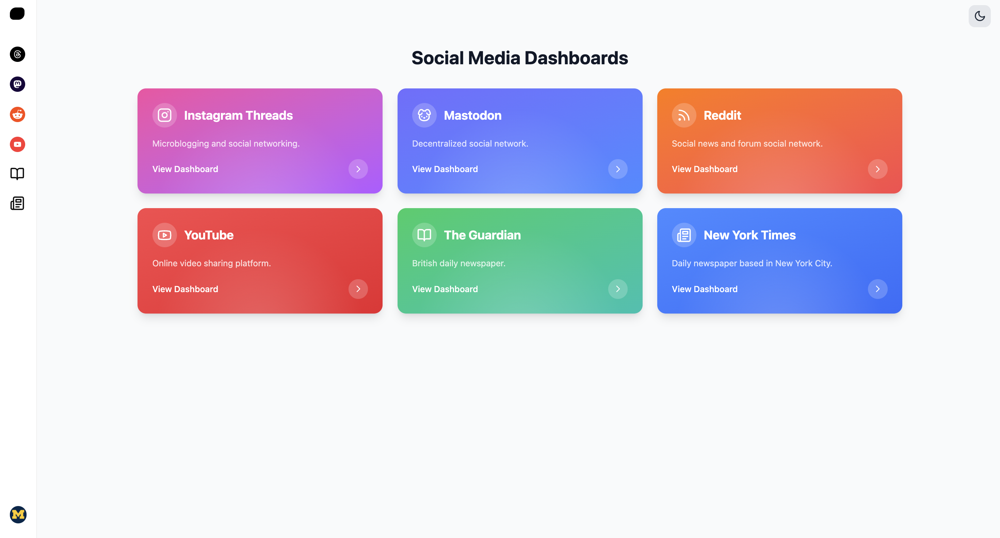

<p align="center">
  
</p>

<h1 align="center">
  AIMS Official Website
</h1>

<p align="center">
  
  <a aria-label="License" href="https://github.com/jere67/aims-dashboard/blob/main/LICENSE">
    
  </a>
</p>

# UROP Sentiment Analysis Dashboard
The repository for the official website for the dashboard as featured at the annual Undergraduate Research Opportunity Program (UROP) Symposium. 

## ⭐ Features
- ⚡️ React 19
- 📜 Sentiment Analysis with the BERT transformer
- 🎨 Tailwind CSS - for modern styling
- 🃏 Aceternity UI - accessible UI components
- 📱 Fully Responsive
- 🎨 Animation - using Framer Motion

## ✍🏻 Authors

- [@jere67](https://github.com/jere67)
- [@akutira-umich](https://github.com/akutira-umich)
- [@AndreGalaGarza](https://github.com/AndreGalaGarza)
- [@HuawenShen](https://github.com/HuawenShen)
- [@Patrickyang23](https://github.com/Patrickyang23)

## 🪪 License

Please do not deploy this directly to production. It is not a template and is not intended to be used as one.

This project is open source and available under the [MIT License](LICENSE).

## 🛠️ Environment Setup
### Prerequisites

Before starting, ensure you have the following tools installed:

1. Git:
   - Download: [https://git-scm.com/](https://git-scm.com/)
   - Verify: `git --version`
2. Node.js and npm:
   - Download: [https://nodejs.org/](https://nodejs.org/) (LTS version recommended)
   - Verify: `node --version` and `npm --version`
3. Python:
   - Download: [https://www.python.org/](https://www.python.org/) (version 3.8+ recommended)
   - Verify: `python --version` or `python3 --version`

### Local Setup

1. Clone the Repository
   ```bash
   git clone https://github.com/jere67/aims-dashboard.git
   cd aims-dashboard
   ```
  
### Frontend
1. From the ```/frontend``` directory, install Node dependencies:

    `npm install`

2. Start the Vite development server:

    `npm run dev`

The frontend application will be running at `http://localhost:5173`

### Backend
1. Create a virtual environment:
  - ```python -m venv venv```
  - And activate it:
    - Windows: ```venv\Scripts\activate```
    - macOS/Linux: ```source venv/bin/activate```

2. From the ```/backend``` directory, install necessary Python packages:

    `pip install -r requirements.txt`

    - For Playwright, after installation, run:
      - ```playwright install```