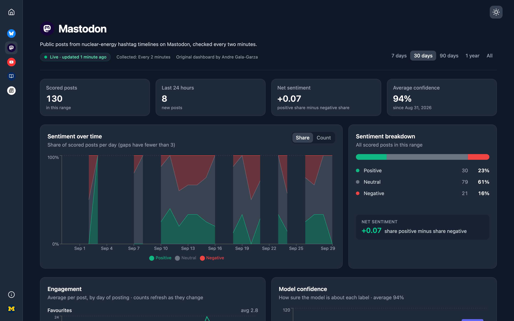

<p align="center">
  
</p>

<h1 align="center">Nuclear Energy Sentiment Dashboard</h1>

<p align="center">
  Live public sentiment toward nuclear energy across social media and news, from the
  <a href="https://www.aims-umich.com/">AIMS Lab</a> at the University of Michigan.
</p>

The dashboard collects public posts, comments, and articles about nuclear energy as they are published.
A BERT model fine-tuned on nuclear-energy discourse (`kumo24/bert-sentiment-nuclear`) labels each one positive, neutral, or negative, with a confidence score.
It started as a UROP Symposium project and now runs as a live service at `dashboard.aims-umich.com`.

## Sources

| Platform | How it is collected | Freshness |
|---|---|---|
| Bluesky | Jetstream firehose (no account needed); deletions honored as they arrive | Seconds |
| Mastodon | Public hashtag timelines | 2 minutes |
| YouTube | New nuclear-energy videos, then their comment threads (Data API v3); refreshed or deleted within 30 days | 30 minutes |
| The Guardian | Content API, scored sentence by sentence | 30 minutes |
| New York Times | Article Search API (abstract and lead paragraph); history from the Archive API | 1 hour |
| Reddit | Official API; off until Reddit approves research access | 2 minutes |

Every source uses its official API within its terms. YouTube data is refreshed or deleted within 30 days (Developer Policies III.E.4) and shown only as topic-level aggregates, never per-channel scores; an optional per-platform text retention window (`TEXT_RETENTION_HOURS`) keeps only scores after it expires.
Threads and X are not collected.
Posts are filtered before scoring: idioms ("the nuclear option"), weapons and geopolitics, medicine, and non-English text are excluded, so trends reflect discussion of nuclear energy.

## Architecture

```
 sources ──> ingest ──> Postgres (documents → segments → predictions) <── api <── Vercel (React) <── viewers
                           │  NOTIFY                ▲
                           └────────> scorer (BERT on CPU)
```

- `backend/sentiment/ingest` - one isolated job per source, idempotent upserts, cursors in `ingest_state`.
- `backend/sentiment/scorer` - claims unscored segments (`SKIP LOCKED`), wakes on `LISTEN/NOTIFY`, stores all three probabilities per model so a new model can score in shadow mode before it is switched on. While the queue is empty it computes per-word explanations (integrated gradients) for recent posts.
- `backend/sentiment/api` - read-only FastAPI with SQL aggregates, caching, and rate limiting.
- `frontend` - React 19 + Vite + Tailwind 4 with hand-built SVG charts: an overview, one data-driven page per platform, and Compare, Topics, Events, and Model pages.
- `compose.yaml` - the whole backend on one machine (an Oracle Cloud Always Free VM in production), with Caddy for HTTPS.

Setup and operations (Oracle VM, DNS, Vercel, keys, backups, monitoring) are in [deploy/README.md](deploy/README.md).

## Local development

Requirements: Python 3.12, Node 22+, and Postgres 16 (or Docker).

```bash
# Backend
cd backend
python3.12 -m venv .venv && source .venv/bin/activate
pip install -c constraints.txt -e ".[dev,scorer]"
export DATABASE_URL=postgresql://postgres@localhost:5432/dashboard
sentiment migrate
sentiment seed-demo         # fake data for every platform, or run the real services below
sentiment api               # http://127.0.0.1:8000/api/docs
sentiment ingest            # collectors (Bluesky and Mastodon work without keys)
sentiment scorer            # downloads the model on first run

# Frontend (proxies /api to 127.0.0.1:8000)
cd frontend
npm install
npm run dev                 # http://localhost:5173
```

Or run everything in containers: `cp deploy/env.example .env`, set `POSTGRES_PASSWORD`, then `docker compose up --build`.

Other commands:

- `sentiment import-legacy guardian mastodon nyt` - load the pre-2026 SQLite/CSV data (kept locally, never in git).
- `sentiment relevance [--dry-run]` - re-apply the relevance rules after changing them.
- `sentiment topics [--dry-run]` - re-apply the topic rules in `sentiment/topics.py` after changing them.
- `sentiment backfill-nyt --from 2021-01 --to 2025-12 --replace-legacy` - rebuild NYT history from the Archive API.
- `sentiment models list` / `sentiment models activate NAME [REVISION]` - choose which model the dashboard shows.

## Tests

```bash
cd backend && ruff check . && ruff format --check . && pytest   # needs TEST_DATABASE_URL (a disposable database)
cd frontend && npm run lint && npm run build
cd frontend && npx playwright test                               # needs an API on :8000 with `sentiment seed-demo` data
```

CI runs all of these on every pull request.

## Authors

- [@jere67](https://github.com/jere67)
- [@akutira-umich](https://github.com/akutira-umich)
- [@AndreGalaGarza](https://github.com/AndreGalaGarza)
- [@HuawenShen](https://github.com/HuawenShen)
- [@Patrickyang23](https://github.com/Patrickyang23)

## License

MIT, see [LICENSE](LICENSE).
Collected content belongs to its authors and platforms and is not part of this repository.
